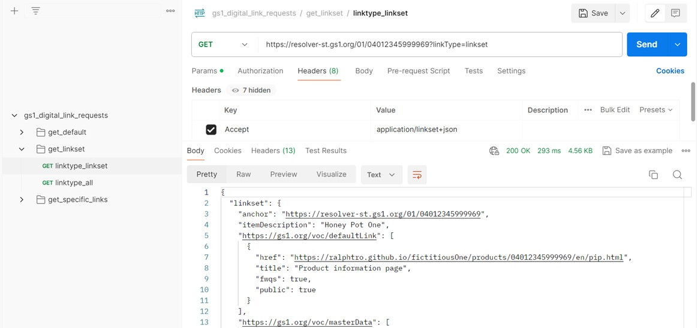

# GS1 Digital Link Postman Collection

Postman Collection with a number of logically grouped GS1 Digital Link Requests.

**Speciality: all placeholder requests point to actual existing (though typically fictitious) web resources (e.g. web pages, JSON-LD files, etc.)!**

## Purpose

This repo aims at helping in various areas, e.g.:

* Demonstrate how GS1 Digital Link API requests work.
* Show how GS1 Digital Link requests can be tailored to your/your organisation's needs.
* Speed up time for developers (e.g. in seeting up a test environment for GS1-compliant resolvers).
  
## Setup

0. (If applicable) Register for [Postman](https://postman.com/) and (recommended) install the desktop app.
1. Import the JSON file (`gs1_digital_link_requests.postman_collection.json`) via the `Import` button.
2. Select a request and execute it via the `Send` button.

As a placeholder, each request already includes a working GS1 Digital Link URI. Just replace the latter with any other GS1 Digital Link URI you desire.

Screenshot (here: requesting the linkset for a given GTIN):

## Contribute

Contributions (e.g. useful additions) are very welcome. For instance, in case you expanded this collection in your Postman editor with other helpful requests you would like to share with the community, export it to your forked branch and simply submit the latter as a Pull Request back to this repo.

## Status

Prototype

## License

 

* Author: Ralph Tröger (<ralph.troeger@gs1.de>)
* Copyright: 2024
* License: Apache-2.0
